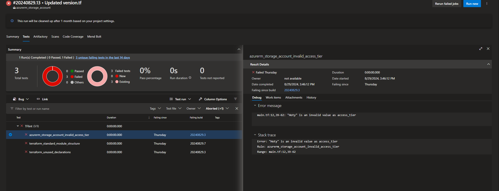

# TFLINT testing 

## Introduction

As part of module development, we've added the TFLINT linting tool to help module developers follow best practices in Terraform, such as defining variable types, removing unused declarations, and more.

As developers, you don’t need to take any additional action. The TFLINT task will automatically run in our Validate Job.

Once the run is finished, the results will be published in the "Test" tab in Azure DevOps, allowing you to review any errors that may be present.

  

Please note that the job will fail if any errors are detected to prevent code from being pushed to the dev and master branches. You'll need to fix these errors and rerun the pipeline before proceeding.

If you encounter any false positives or need to exclude any errors, you'll need to open a Pull Request (PR) in the terraform_yaml_pipeline_templates repository. 

In this repository, you'll find a folder named .azuredevops and, within it, a file called .tflint.hcl where exceptions can be managed.

The file look like this

```json
plugin "terraform" {
  enabled = true
  preset  = "recommended"
}
plugin "azurerm" {
    enabled = true
    version = "0.27.0"
    source  = "github.com/terraform-linters/tflint-ruleset-azurerm"
}

rule "terraform_required_providers" {
  enabled = false
}

rule "terraform_required_version" {
  enabled = false
}
```

To create an exception, you only need to specify the rule by its correct name and set enabled to false in the .tflint.hcl file. After making this change, you'll need to open a Pull Request (PR) so the exception can be applied.
