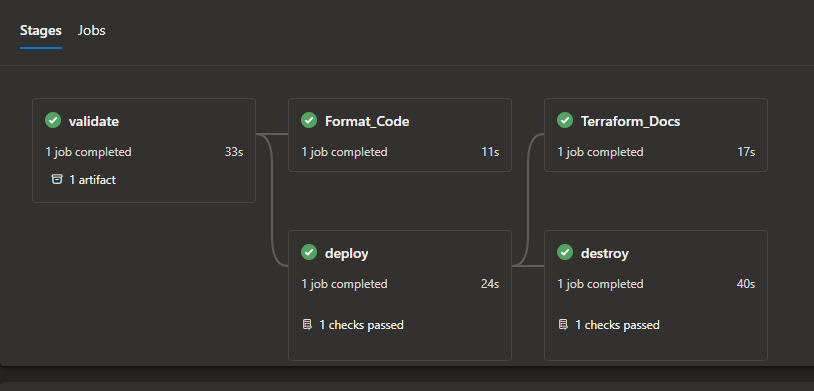
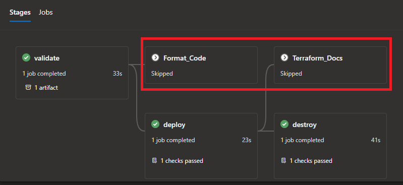

# TERRAFORM YAML PIPELINE HOWTO

## Introduction

This document provides a detailed explanation of the pipeline variables and how they can be used to control the behaviors of different stages in the pipeline.  

This is a simple example of how to use Axpo Terraform modules with Azure DevOps Pipelines. See the [Examples](./Examples/pipelines/) folder for the required files to set up.  

Also have a look at the [Terraform UseCase Template](https://dev.azure.com/Axpo-AXSO/TIM-INFRA-MODULES/_git/axso_usecase_template) repository for an example on how to structure the layout of your Infrastructure as Code (IaC) repository and pipelines.

## Resource Deployment Pipeline

Copy the file `azure-pipeline-[project]-[azureservicename]-[environment].yml` to your repository containing the asset/module you want to deploy, rename the file and adjust the parameters based on the service you are deploying.  

**Example:** `azure-pipeline-mds-storageaccount-dev.yml`

```yaml
trigger:
  none

resources:
  repositories:
    - repository: Terraform_Deployment_Pipeline
      type: git
      name: TIM-INFRA-MODULES/terraform_yaml_pipeline_templates
      ref: refs/heads/main

stages:
  - template: tf_main.yml@Terraform_Deployment_Pipeline
    parameters:
          environment_name: "MDS-DEV"
          tfvarFile: "storageaccounts.tf.tfvars"
          root_directory: "/Market_Data_System/003_MDS_StorageAccounts/"
          service_connection_name: "cl-axso-az-devops-tim-infra-modules-spi"
          backend_resource_group: "axso-prod-appl-tim-infra-modules-rg"
          backend_storage_accountname: "axso4prod4appl4tim4sa"
          container_name: "terraform-tim-infra-modules"
          container_key: "MDS/mds_dev_storage_accounts.tfstate"
          pool: "DevOpsAgentPoolName"
          terraformVersion: "${{ variables.terraformVersion }}"
          environment_name_Job: "MDS_DEV_STORAGEACCT"
```

## Pipeline Parameters

The following parameters are required to be set in the deployment pipeline:

- `environment_name`: The name of the environment. This is used to set the environment name in the pipeline based on [Azure DevOps Environments](https://learn.microsoft.com/en-us/azure/devops/pipelines/process/environments?view=azure-devops?wt.mc_id=DT-MVP-5004771). **Consumers needs to update this to match their environment naming convention.**
- `tfvarFile`: The name of the tfvars file to be used for the deployment. **Consumers needs to update this to match their tfvars file settings.**
- `root_directory`: The root directory path where the terraform code and `tfvarsfile` is located. **Consumers needs to update this to match their directory structure.**
- `service_connection_name`: The name of the Azure DevOps service connection to be used for the deployment. Ensure this has access to the subscription where the resources are being deployed. **Consumers needs to update this to match their service connection settings.**
- `backend_resource_group`: The name of the resource group where the backend storage account is located to store the state files. **This parameter does not need to be changed and should remain as: `"axso-prod-appl-tim-infra-modules-rg"`**
- `backend_storage_accountname`: The name of the backend storage account to store the state files. **This parameter does not need to be changed and should remain as: `"axso4prod4appl4tim4sa"`**
- `container_name`: The name of the container in the backend storage account to store the state files. **Consumers needs to update this to match their project name**
- `container_key`: The name of the state file to be created/amended. **Consumers needs to update this to match their project name/resource.tfstate**
- `pool`: The name of the agent pool to be used for the deployment. **Consumers needs to update this to match their agent pool settings.**
- `terraformVersion`: The version of Terraform to be used for the deployment. **Consumers needs to update this to match their Terraform version settings (e.g. 1.7.0).**
- `environment_name_Job`: The name of the job to be used for the deployment. **Consumers needs to update this to match their environment naming convention.**

## Pipeline Variables

You will notice that the deployment pipeline references a variable template:  

```yaml
variables:
  - template: storageaccount-dev-vars.yml
```

This is to ensure that parameters and any other variables are set in a consistent way. The variable template is located in the  [Examples](./Examples/pipelines/) folder.

You can add any additional variables based on the resource being deployed. Copy the file `[azureservicename]-[environment]-vars.yml` to your repository where the deployment pipeline is hosted, rename the file and adjust/add the variables based on the service you are deploying.  

**Example:** `storageaccount-dev-vars.yml`

```yaml
# Replace tokens 
variables:
  - name: terraformVersion
    value: '1.5.7'

# Feature Flags (By default these are disabled and have to be explicitly enabled)
  - name: destroy # Trigger the destroy stage to remove the infrastructure
    value: 'true'

  - name: terraform_docs # Automatically generate terraform documentation - Only usable on 'feature' branches
    value: 'true'

  - name: terraform_format # Automatically format terraform code - Only usable on 'feature' branches
    value: 'true'
```

## Feature Flags - Optional Stages

Here is a detailed explanation on how to control the optional stages of the pipeline: `Format_Code`, `Terraform_Docs`, and `Destroy`. By default, these stages are disabled. This guide will show you how to enable them.

## Stages

**Format_Code:** This stage formats the Terraform code using the `tf_format_code.yml` template. It only runs if the `terraform_format` variable is set to `true` and the build source branch starts with `refs/heads/feature`.  
To enable the `Format_Code` stage, set the `terraform_format` variable to `true`. Here is an example:  

```yml
variables:
  terraform_format: 'true'
```

**Terraform_Docs:** This stage generates Terraform documentation using the `tf_docs.yml` template. It only runs if the `terraform_docs` variable is set to `true` and the build source branch starts with `refs/heads/feature`.  
To enable the `Terraform_Docs` stage, set the `terraform_docs` variable to `true`. Here is an example:  

```yml
variables:
  terraform_docs: 'true'
```

## Destroy

This stage destroys the resources using the `tf_destroy.yml` template. It only runs if the `destroy` variable is set to `true` and the build source branch is either `refs/heads/dev`, `refs/heads/main` or `starts with refs/heads/feature`.  
To enable the `Destroy` stage, set the `destroy` variable to `true`. Here is an example:  

```yml
variables:
  destroy: 'true'
```

By setting these variables, you can control the execution of these optional stages in the pipeline.  
For example all features enabled:  

```yml
# Feature Flags (By default these are disabled and have to be explicitly enabled)
  - name: destroy # Trigger the destroy stage to remove the infrastructure
    value: 'true'

  - name: terraform_docs # Automatically generate terraform documentation - Only usable on 'feature' branches
    value: 'true'

  - name: terraform_format # Automatically format terraform code - Only usable on 'feature' branches
    value: 'true'
```



Format Code and Terraform Docs disabled, but destroy enabled:

```yml
# Feature Flags (By default these are disabled and have to be explicitly enabled)
  - name: destroy # Trigger the destroy stage to remove the infrastructure
    value: 'true'

  - name: terraform_docs # Automatically generate terraform documentation - Only usable on 'feature' branches
    value: 'false'

  - name: terraform_format # Automatically format terraform code - Only usable on 'feature' branches
    value: 'false'
```



## Pipeline Stages

The deployment pipeline consists of the following stages:

## 1. Validate:

This stage defines an Azure DevOps pipeline for validating and planning a Terraform configuration. Here's a summary of its main actions:  

1. **Parameters**: It accepts several parameters like the container name, environment name, root directory, etc. These parameters are used throughout the pipeline.
2. **Jobs**: It defines a single job named "Validate" which runs on a specified pool.
3. **Steps**: The job consists of several steps:
   - **Checkout-self**: It checks out the code from the repository.
   - **Checkout-pipelines**: It checks out the code from the pipelines repository.
   - **AzureKeyVault**: It fetches secrets from Azure Key Vault.
   - **InstallSSHKey**: It installs an SSH key for accessing a Git repository.
   - **TerraformInstaller**: It installs a specific version of Terraform.
   - **Replace tokens**: It replaces tokens in the Terraform files.
   - **Tflint**: Tflint tool help us to reveal issues in the code.(Only for module development)
   - **PublishTestResults**: It publishes the Tflint results in the pipeline for analysis
   - **Terraform Init**: It initializes the Terraform configuration.
   - **Terraform Validate**: It validate the Terraform configuration.
   - **Terraform Plan**: It runs a Terraform plan and saves the output.
   - **PowerShell**: It runs a PowerShell script to analyze the Terraform plan output and set pipeline variables based on the changes detected.
   - **Prepare Artifacts**: If the pipeline was not triggered by a pull request, it prepares build artifacts by copying relevant files to an artifacts directory.
   - **PublishBuildArtifacts**: If the pipeline was not triggered by a pull request, it publishes the build artifacts.

In summary, this stage is designed to validate and plan a Terraform configuration, analyze the changes that would be made, and prepare and publish build artifacts if the pipeline was not triggered by a pull request.  

## 2. deploy:

This stage outlines an Azure DevOps pipeline that deploys infrastructure using Terraform. Here's a summary of its main actions:  

1. **Parameters**: It accepts several parameters like the container name, key, environment name, Terraform variable file, root directory, service connection name, backend resource group, backend storage account name, and the Terraform version.
2. **Steps**: The pipeline consists of several steps:
   - **Download**: It disables automatic artifact download.
   - **DownloadBuildArtifacts**: It downloads the build artifacts for the current build, named after the environment, to the system's artifact directory.
   - **AzureKeyVault**: It fetches all secrets from a specified Azure Key Vault using an Azure Resource Manager service connection.
   - **InstallSSHKey**: It installs an SSH key using the known hosts entry, public key, and passphrase fetched from the key vault.
   - **TerraformInstaller**: It installs a specific version of Terraform, as defined by the `terraformVersion` parameter.
   - **Terraform Init**: It initializes the Terraform configuration using the AzureRM provider and backend details for storing the Terraform state.
   - **Terraform Apply**: It applies the Terraform configuration using the AzureRM provider and a Terraform variable file.

In summary, this pipeline downloads build artifacts, fetches secrets from Azure Key Vault, installs an SSH key and a specific version of Terraform, initializes the Terraform configuration, and applies the Terraform configuration by deploying infrastructure.

## 3. destroy: (Optional stage)

This in an optional stage that defines an Azure DevOps pipeline that uses Terraform to destroy infrastructure. 
The stage can be triggered by setting the `destroy` variable to `true`.

```yml
# Feature Flags (By default these are disabled and have to be explicitly enabled)
  - name: destroy # Trigger the destroy stage to remove the infrastructure
    value: 'true'
```

Here's a brief summary of what the stage does:

1. **Parameters**: It accepts various parameters like container name, key, environment name, Terraform variable file, root directory, service connection name, backend resource group, backend storage account name, and Terraform version.
2. **Steps**: The pipeline performs several steps:
   - **Download**: It first disables automatic artifact download.
   - **DownloadBuildArtifacts**: It downloads the specific build artifacts for the current build, named after the environment, to the system's artifact directory.
   - **AzureKeyVault**: It fetches all secrets from a specified Azure Key Vault using an Azure Resource Manager service connection.
   - **InstallSSHKey**: It installs an SSH key using the known hosts entry, public key, and passphrase fetched from the key vault.
   - **TerraformInstaller**: It installs a specific version of Terraform, as defined by the `terraformVersion` parameter.
   - **Terraform Init**: It initializes the Terraform configuration using the AzureRM provider and backend details for storing the Terraform state.
   - **Terraform Destroy**: It destroys the Terraform configuration using the AzureRM provider and a Terraform variable file.

In summary, this stage downloads build artifacts, fetches secrets from Azure Key Vault, installs an SSH key and a specific version of Terraform, initializes the Terraform configuration, and then destroys the Terraform configuration by removing infrastructure.

## 4. Format_Code: (Optional stage)

This in an optional stage that can automatically lint and format Terraform code using tf format.  
The stage can be triggered by setting the `terraform_format` variable to `true` (only effective on feature branches).

```yml
# Feature Flags (By default these are disabled and have to be explicitly enabled)
  - name: terraform_format # Automatically format terraform code - Only usable on 'feature' branches
    value: 'true'
```

Here's a brief summary of what the stage does:

This stage defines an Azure DevOps pipeline job that formats Terraform code and commits the changes back to the repository. Here's a brief summary:  

1. **Parameters**: The pipeline accepts a parameter for the agent pool that runs the job.
2. **Jobs**: The pipeline consists of a single job named `Format_Code` that runs on the specified agent pool. The workspace for the job is cleaned before it runs.
3. **Steps**: The job consists of several steps:
   - **Checkout**: The pipeline checks out the code from the repository, allowing later steps to use the same credentials to interact with the repository.
   - **Format Code**: The pipeline runs a PowerShell script that changes the current directory to the source directory of the build, formats all Terraform files in the directory and its subdirectories, and outputs a message indicating that the files are being formatted.
   - **Commit and Push**: The pipeline runs another PowerShell script that stages all changes, commits the changes with a message, and pushes the commit to the source branch of the build. The script uses a predefined variable in Azure Pipelines for accessing the repository.

In summary, this stage formats Terraform code in the repository and commits the formatted code back to the repository.

## 5. Terraform_Docs: (Optional stage)

This in an optional stage that can automatically generate Terraform documentation using terraform docs.  
The stage can be triggered by setting the `terraform_docs` variable to `true` (only effective on feature branches).

```yml
# Feature Flags (By default these are disabled and have to be explicitly enabled)
  - name: terraform_docs # Automatically generate terraform documentation - Only usable on 'feature' branches
    value: 'true'
```

This stage defines an Azure DevOps pipeline job that performs the following tasks:

1. **Parameters**: The pipeline accepts two parameters: the version of Terraform-Docs to install and the agent pool that runs the job.
2. **Jobs**: The pipeline consists of a single job named `Terraform_Docs` that runs on the specified agent pool. The workspace for the job is cleaned before it runs.
3. **Steps**: The job consists of several steps:
   - **Checkout**: The pipeline checks out the code from the repository, allowing later steps to use the same credentials to interact with the repository.
   - **Install Terraform-Docs**: The pipeline downloads the specified version of Terraform-Docs from GitHub, extracts it to a directory, and adds the directory to the system `Path`.
   - **Update README.md Files**: The pipeline changes the current directory to the source directory of the build, gets all subdirectories (assumed to be Terraform module directories), and checks each directory for `README.md` files. If a `README.md` file exists, the script updates the file by generating a markdown table of the Terraform module in the directory. If a README.md file does not exist, the script creates a new file and generates a markdown table of the Terraform module in the directory.
   - **Commit and Push**: The pipeline pulls the latest changes from the source branch of the build, stages the updated `README.md` files, commits the changes with a message, and pushes the commit to the source branch of the build.

In summary, this stage installs Terraform-Docs, updates README.md files for each Terraform module in the repository, and commits the updated files back to the repository.  
